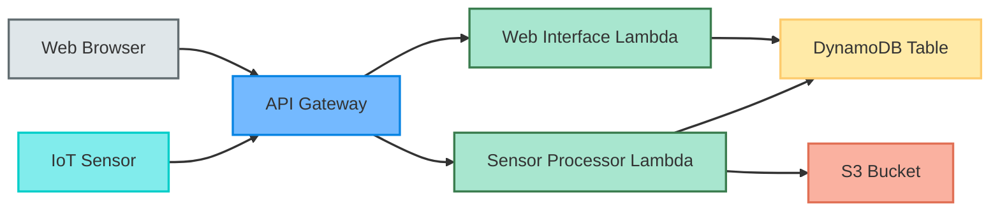

<!-- _class: lead -->
# Water Sensor Tracker
## A Cloud-Native IoT Solution

---

<!-- _class: default -->
# Project Overview

The Water Sensor Tracker is a cloud-native IoT solution built with:

-  AWS CDK (Infrastructure as Code)
-  Python Lambda Functions
- API Gateway REST API
- DynamoDB for real-time data
- S3 for data archival

---

# Architecture



---

# Key Components

## Data Ingestion
- IoT sensors send data via HTTP POST
- API Gateway routes requests to Lambda
- Data stored in DynamoDB with TTL
- Historical data archived to S3

## Web Interface
- Modern, responsive web UI
- Real-time sensor data display
- Pagination with 20 records per page
- Multiple sensor selection
- Built with vanilla JavaScript for lightweight performance

---

# Data Flow

## Ingestion Flow
1. Sensors send readings via HTTP POST
2. Sensor Processor Lambda validates and processes data
3. Current data stored in DynamoDB
4. Historical data archived to S3

## Web Interface Flow
1. Users access web UI via browser
2. Web Interface Lambda serves HTML/JS/CSS
3. UI makes API calls for paginated data
4. DynamoDB queries return latest sensor readings

---

# Infrastructure (CDK)

## Stack Components

### DynamoDB Table
- Partition Key: `sensorId`
- Sort Key: `timestamp`
- TTL: 90 days
- Environment-specific settings:
  - Dev: Delete on destroy
  - Prod: Retain on destroy

### S3 Bucket
- Versioning enabled
- Lifecycle rules:
  - Dev: Move to IA after 30 days
  - Prod: Move to IA after 90 days

### API Gateway
- REST API endpoints:
  - POST /sensors
  - GET /sensors/{sensorId}
- Environment settings:
  - Dev: INFO logging, data tracing
  - Prod: ERROR logging, no tracing

### Lambda Function
```typescript
new lambda.Function(this, 'SensorProcessor', {
  runtime: lambda.Runtime.PYTHON_3_9,
  handler: 'sensor_processor.handler',
  code: lambda.Code.fromAsset('lambda'),
  environment: {
    TABLE_NAME: table.tableName,
    BUCKET_NAME: bucket.bucketName,
    ENVIRONMENT: envName
  }
});
```

---

# Lambda Function Implementation

## Data Processing (POST /sensors)

```python
def process_sensor_data(event):
    # Validate required fields
    required_fields = ['sensorId', 'temperature', 
                      'humidity', 'waterLevel']
    
    # Store in DynamoDB
    item = {
        'sensorId': body['sensorId'],
        'timestamp': timestamp,
        'temperature': body['temperature'],
        'humidity': body['humidity'],
        'waterLevel': body['waterLevel'],
        'ttl': int(time.time()) + (90 * 24 * 60 * 60)
    }
    
    # Archive to S3
    s3.put_object(
        Bucket=bucket_name,
        Key=f"sensors/{body['sensorId']}/{timestamp}.json",
        Body=json.dumps(item)
    )
```

## Data Retrieval (GET /sensors/{sensorId})

```python
def get_sensor_data(event):
    sensor_id = event['pathParameters']['sensorId']
    
    # Query DynamoDB
    response = table.query(
        KeyConditionExpression='sensorId = :sid',
        ExpressionAttributeValues={':sid': sensor_id},
        ScanIndexForward=False,
        Limit=100
    )
    
    return {
        'statusCode': 200,
        'body': json.dumps(response['Items'])
    }
```

---

# Testing Strategy

## Infrastructure Tests (Jest)

```typescript
it('creates DynamoDB table with dev settings', () => {
  template.hasResourceProperties('AWS::DynamoDB::Table', {
    BillingMode: 'PAY_PER_REQUEST',
    TimeToLiveSpecification: {
      AttributeName: 'ttl',
      Enabled: true
    }
  });

  template.hasResource('AWS::DynamoDB::Table', {
    DeletionPolicy: 'Delete',
    UpdateReplacePolicy: 'Delete'
  });
});
```

## Lambda Function Tests (pytest)

```python
def test_post_sensor_data(dynamodb_table, s3_bucket):
    """Test POST request to store sensor data."""
    response = handler(POST_EVENT, {})
    
    # Verify response
    assert response['statusCode'] == 200
    
    # Verify DynamoDB entry
    items = list(dynamodb_table.scan()['Items'])
    assert len(items) == 1
    assert items[0]['sensorId'] == 'test-sensor-1'
    assert float(items[0]['temperature']) == 25.5
```

---

# Development Workflow

## Local Development
```bash
# Install dependencies
npm install
pip install -r requirements-dev.txt

# Run tests
npm test
```

## Deployment
```bash
# Deploy to development
npm run deploy:dev

# Deploy to production
npm run deploy:prod
```

---

# Best Practices Implemented

## Infrastructure as Code
- Versioned infrastructure
- Environment-specific configurations
- Consistent deployments

## Security
- Least privilege IAM roles
- Environment separation
- Resource policies

## Testing
- Comprehensive test coverage
- Mock AWS services
- Environment-specific tests

## Data Management
- Real-time data in DynamoDB
- Long-term storage in S3
- Automatic data lifecycle

---

# Future Enhancements

## Monitoring & Alerting
- CloudWatch alarms
- SNS notifications
- Anomaly detection

## Analytics
- Data visualization
- Trend analysis
- Reporting system

## Security
- API authentication
- Data encryption
- Audit logging

---

<!-- _class: lead -->
# Thank You!

For more information:
- Source code: [GitHub Repository]
- Documentation: [Project Wiki]
- Contact: [Team Contact]
